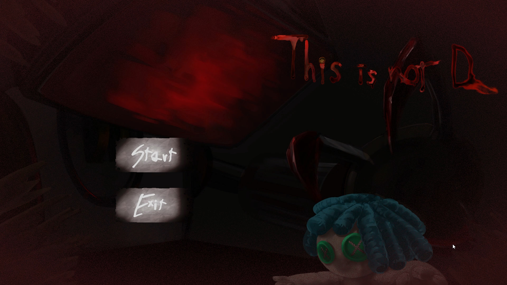
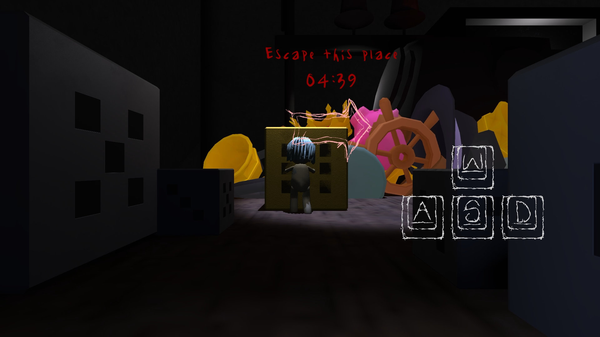
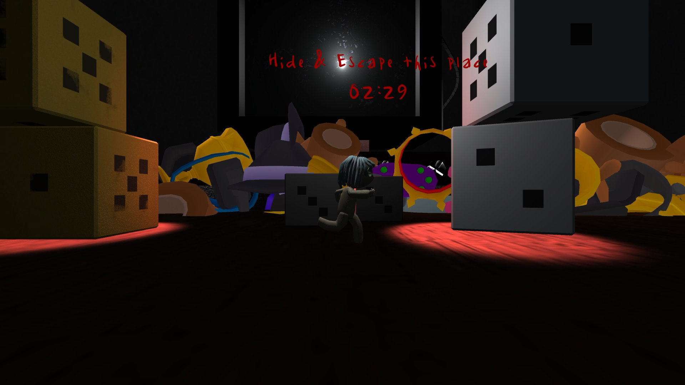

# ThisisnotD

  

Unity로 제작한 3D 게임입니다.

제한 시간 안에 오브젝트를 밀고, 엄폐물 뒤에 숨어 보스의 시야를 피하며 탈출하는 게임입니다.

---

## 프로젝트 소개

| 항목 | 내용 |
| --- | --- |
| 플랫폼 | PC |
| 개발 엔진 | Unity |
| 개발 언어 | C# |
| 개발 기간 | 2024.09.01 ~ 2024.12.20 |
| 개발 인원 | 총 3명 |
| 팀 구성 | 아트 2명 / 프로그래밍 1명 (본인) |

---

## Gameplay

| 초반 플레이 장면 | 보스의 추격 장면 |
| :---: | :---: |
|  |  |

게임 플레이 영상은 아래 링크에서 확인할 수 있습니다.

[ThisisnotD Gameplay Video](https://youtu.be/aMAQvpVFlr4)

---

## Download

게임 실행 파일은 아래 링크에서 다운로드할 수 있습니다.

- [Download for Windows](https://drive.google.com/file/d/19dEpyFZtkxwR7povUbqtlJ0VQR-Dc787/view)
- [Download for macOS](https://drive.google.com/file/d/1YgbZ_0cqSjRkVH5SivMYDDFPsDBWPGR3/view)

---

## My Role

프로그래밍 전체를 담당했습니다.

- Rigidbody 기반 플레이어 이동과 오브젝트 밀기 구현
- 체크포인트 도달 단계에 따른 게임 진행, 제한 시간, 엔딩 씬 전환 구현
- 보스 이동 연출과 시야(SphereCast) 기반 플레이어 감지 구현
- 버드뷰 카메라 전환 구현
- 진행 단계별 BGM 전환과 조작 키 안내 UI 구현

---

## 주요 구현 내용

### 보스 시야 감지와 엄폐

보스의 양쪽 눈(`LeftEye`, `RightEye`)이 매 프레임 시선 방향으로 `Physics.SphereCast`를 반복해서 쏘며 플레이어를 찾습니다. 둘 중 하나라도 플레이어를 감지하면 `BossEyes`에서 플레이어를 사망 상태로 바꿉니다.

엄폐물(`HideObject`)과 밀 수 있는 오브젝트(`ObjectMove`)는 각자 `Physics.BoxCast`와 `LayerMask`로 지정한 방향의 가까운 범위 안에 플레이어가 있는지 확인해 상태 값으로 저장합니다. 보스의 시선이 플레이어에 닿았을 때 엄폐물 중 하나라도 이 상태 값이 켜져 있으면 숨은 것으로 보고 감지하지 않습니다. 시선이 엄폐물에 먼저 닿으면 그 지점에서 탐색을 멈춥니다.

시선 경로와 BoxCast 범위는 `OnDrawGizmos`로 씬 뷰에 그려 배치를 조정할 때 확인할 수 있게 했습니다.

**관련 코드** [BossEyes.cs](https://github.com/Thispring/ThisisnotD/blob/main/Script/Boss/BossEyes.cs) · [LeftEye.cs](https://github.com/Thispring/ThisisnotD/blob/main/Script/Boss/LeftEye.cs) · [HideObject.cs](https://github.com/Thispring/ThisisnotD/blob/main/Script/HideObject.cs) · [ObjectMove.cs](https://github.com/Thispring/ThisisnotD/blob/main/Script/ObjectMove.cs)

### 진행 단계에 따른 보스 연출

체크포인트를 통과할 때마다 `GameManger`의 진행 단계 값(`point`)이 올라가고, 보스는 이 값에 따라 동작합니다.

- 5단계: 보스가 지정된 위치까지 이동한 뒤 눈의 조명과 시선을 좌우로 왕복 회전시킵니다.
- 6단계: 보스가 다음 위치로 이동하고, 시선 회전 속도를 2배로 올려 더 짧은 주기로 좌우를 훑습니다.

단계마다 다른 효과음을 한 번씩 재생하고, 이동이 끝나면 시선 회전을 시작합니다.

**관련 코드** [BossControll.cs](https://github.com/Thispring/ThisisnotD/blob/main/Script/Boss/BossControll.cs) · [BossEyes.cs](https://github.com/Thispring/ThisisnotD/blob/main/Script/Boss/BossEyes.cs)

### 체크포인트와 리스폰

체크포인트 트리거에 플레이어나 밀던 오브젝트가 닿으면 그 위치를 마지막 체크포인트로 저장하고 진행 단계 값을 올립니다. 낙하 구역에 들어가거나 보스에게 감지되면 사망 처리되고, 2초 뒤 마지막 체크포인트 위치에서 다시 시작합니다. 이때 밀 수 있는 오브젝트도 처음 위치로 되돌립니다.

**관련 코드** [CheckPoint.cs](https://github.com/Thispring/ThisisnotD/blob/main/Script/CheckPoint.cs) · [PlayerState.cs](https://github.com/Thispring/ThisisnotD/blob/main/Script/Player/PlayerState.cs) · [FallChecker.cs](https://github.com/Thispring/ThisisnotD/blob/main/Script/FallChecker.cs)

### 카메라 전환

특정 구간에서는 카메라를 버드뷰로 바꿔, 위에서 내려다본 상태로 캐릭터를 조종하도록 했습니다.

카메라 이동은 위치(`Vector3.Lerp`)와 회전(`Quaternion.Lerp`)을 함께 보간하는 코루틴(`MoveToPosition`)으로 만들고, 이동이 끝난 뒤 실행할 작업을 콜백으로 넘길 수 있게 했습니다. 구간에 들어가면 위에서 내려다보는 시점(X축 90°)으로 전환하고, 구간이 끝나면 플레이어 뒤 기본 시점으로 돌아옵니다.

- 구간 시작은 트리거(`CamPoint`)나 체크포인트 진행 단계로 판단합니다.
- 전환 중에는 `isTransitioning` 플래그로 코루틴이 중복 실행되지 않게 막습니다.
- 기본 시점으로 돌아올 때는 플레이어 이동 속도를 0으로 잠그고, 전환 완료 콜백에서 다시 풀어 줍니다.

**관련 코드** [CameraMove.cs](https://github.com/Thispring/ThisisnotD/blob/main/Script/CameraMove.cs) · [CamPoint.cs](https://github.com/Thispring/ThisisnotD/blob/main/Script/CamPoint.cs) · [CheckPoint.cs](https://github.com/Thispring/ThisisnotD/blob/main/Script/CheckPoint.cs)

---

> 본 리포지토리는 포트폴리오 공개를 목적으로 프로젝트의 스크립트 코드만 포함하고 있습니다.
>
> 게임 에셋 및 전체 Unity 프로젝트 파일은 포함되어 있지 않습니다.
